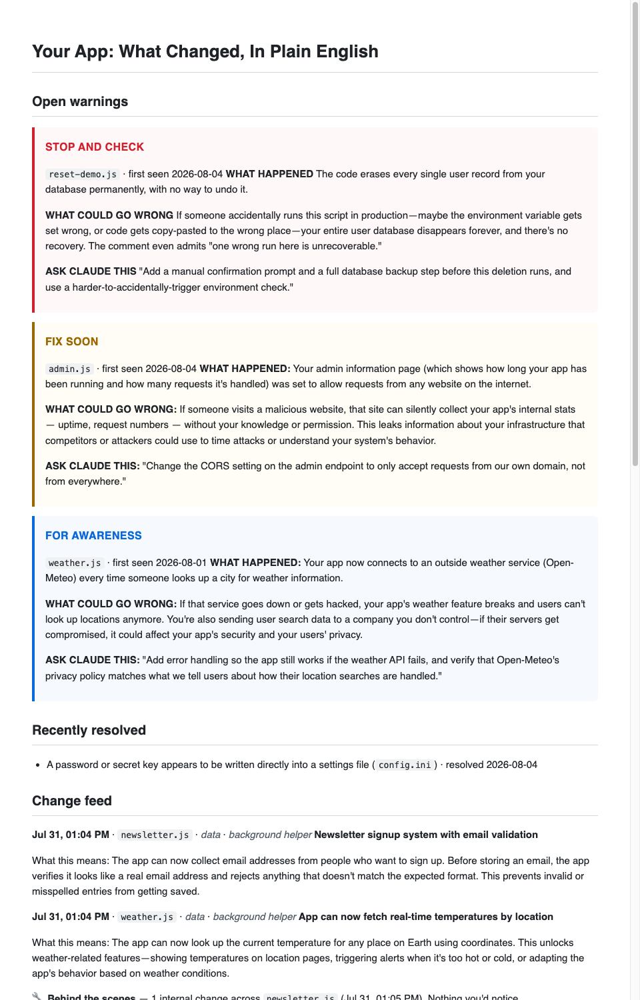

<p align="center">
  
</p>

# Plainspoken

[](https://github.com/EliasMarine/plainspoken/actions/workflows/ci.yml)
[](LICENSE)
[](https://github.com/EliasMarine/plainspoken/tags)


Plain-English narration and safety flags for AI-generated code changes, built as a Claude Code hook.

You build with AI. Plainspoken tells you what actually changed — in consequences, not code. It's the friend who reads the contract before you sign it.

## What you see

Everything lands in one file, `.plainspoken/CHANGELOG.plain.md`. This is a real one from a test project — three warning tiers pinned on top, a fixed issue moved to resolved, and the plain-English feed below:



As text, a session reads like this:

```markdown
# Your App: What Changed, In Plain English

## Open warnings

> ### STOP AND CHECK
> `config.ini` · first seen 2026-08-01
> WHAT HAPPENED: A password or secret key appears to be written directly into a settings file.
> WHAT COULD GO WRONG: Anyone who can read or obtain this file may be able to use
> that password or key as if they were the app.
> ASK CLAUDE THIS: "Move this secret out of the code into a private environment
> setting, make sure that setting is never shared or committed, and replace the
> exposed secret with a new one."

## Change feed

**Aug 03, 3:54 PM** · `notification-send.tsx` · _messages_ · _background helper_
**Duplicate emails can no longer be sent by accidental retries**

What this means: If the app hiccups while sending an email and tries again, your
clients now receive one copy instead of two. Nothing changes about what the
emails say or when they go out.

How it works: Each send now carries a claim ticket — if the same ticket shows up
twice, the second attempt is ignored, like a coat check refusing to hand out the
same coat twice.

🔧 **Behind the scenes** — 9 internal changes across `crm-stages.test.ts`,
`owner-crm-clients.ts` and 2 more files (3:52 – 3:58 PM). Nothing you'd notice.

---
### Session digest · Aug 03, 2026 4:00 PM
The app's customer lists now agree everywhere: the pipeline board, the customers
tab, and the downloadable report all pull from the same roster, so they can no
longer show different people. Email sending also gained protection against
accidental duplicates.
```

Warnings are also surfaced back into the Claude Code session itself, so Claude relays the flag and offers the fix while you're still working.

## How it works

Three layers, all inside one hook script:

- **Narrator** — after Claude Code edits a file, a plain-English entry describes the consequence, never the mechanics. Rapid edits to the same file are batched ("burst narration") and narrated once as a settled outcome. Edits made by subagents are captured too, labeled _background helper_. Test files are narrated as verifications, docs as documents — never as app behavior.
- **Inspector** — a local rule engine (no network, runs before any model call) checks every change for hardcoded secrets, removed sign-in checks, wildcard CORS, destructive database operations, new outside services, and more. Hits are pinned to the top of the changelog and fed back into the session. Warnings resolve themselves when a later change removes the problem.
- **Tutor** — when a session's turn ends, a short digest tells the story of what got built, restates the most important warning, and (only when genuinely useful) explains one concept with an everyday analogy. Thin or internal-only turns don't produce digests.

## Install

1. Copy two pieces into the target project root:
   - `.claude/settings.json` (or merge the `hooks` block into your existing one)
   - `.plainspoken/plainspoken.py`
2. That's it if you use Claude Code with a subscription — narration runs through `claude -p`. If you have an `ANTHROPIC_API_KEY` set, it uses the API directly (`pip install anthropic`).
3. Ask Claude Code to build something. Watch `.plainspoken/CHANGELOG.plain.md` fill up.

## Safety and privacy

- Everything stays local except the model calls that write the narrations.
- Secret-shaped content (keys, passwords, tokens, credentials in URLs) is redacted from anything sent to a model. Warnings about secrets are built entirely from fixed template text — the secret itself never leaves your machine.
- Sensitive files (`.env`, key files, credential stores) never have their contents sent at all.
- Changed file content is always treated as untrusted data, never as instructions.
- The hook fails open: any error exits silently and can never break or block your coding session.

## Files it creates (all inside `.plainspoken/`)

| File | What it is |
|------|------------|
| events.jsonl | Append-only source of truth: every change, warning, and digest |
| findings.json | Warning lifecycle: open and resolved findings |
| CHANGELOG.plain.md | The human-readable view, rebuilt from the files above |
| concepts.json | Tutor state |
| errors.log | Handler errors (always fail-open) |

Rebuild the view any time with `python3 .plainspoken/plainspoken.py render`. Check your setup with `python3 .plainspoken/plainspoken.py doctor` (exits nonzero when unhealthy).

## Settings (environment variables, all optional)

| Variable | Values | Effect |
|----------|--------|--------|
| PLAINSPOKEN_BACKEND | auto (default), api, cli | `api` = Anthropic API; `cli` = `claude -p` on your subscription; auto prefers the API when a key is set |
| PLAINSPOKEN_DETAIL | brief, standard (default), full | How rich each entry is |
| PLAINSPOKEN_MODE | economy | One batched narration call at session end instead of per-change calls; warnings still real-time |
| PLAINSPOKEN_BURST | off | Disable burst batching (one narration per edit) |
| PLAINSPOKEN_BURST_WINDOW | seconds (default 120) | How long a file's burst must go quiet before it narrates |
| PLAINSPOKEN_FEED_CAP | number (default 40) | How many recent entries the changelog shows |

## Extending

- Add rules to the `RULES` list in `plainspoken.py`: id, severity, plain-English name, the "ask Claude this" fix line, and a regex.
- Severities: **STOP AND CHECK** (act now), **FIX SOON**, **FOR AWARENESS**.
- Run the regression suite with `python3 tests/test_plainspoken.py` (stdlib only, no network; the same suite runs in CI on Python 3.9/3.11/3.13).
- See [PRD.md](PRD.md) for the full product spec, principles, and roadmap.

## License

[MIT](LICENSE) — free to use, modify, and share.
